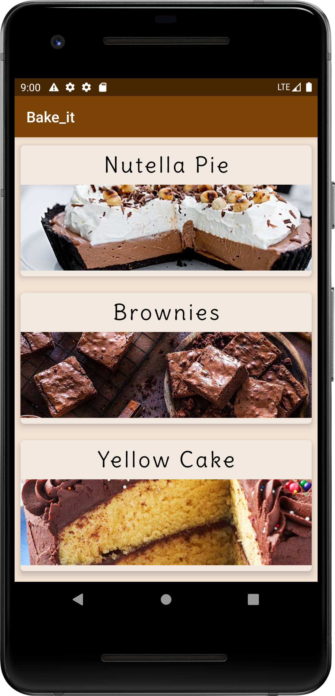
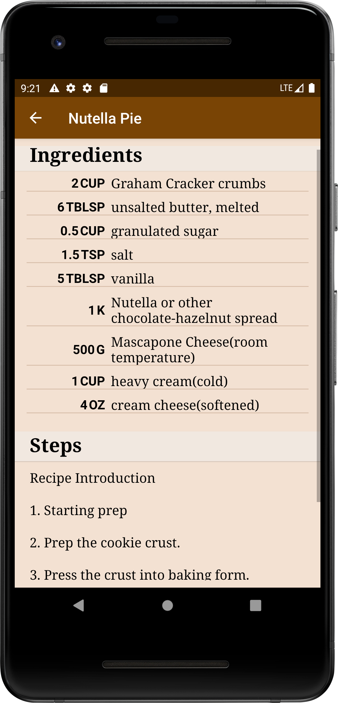
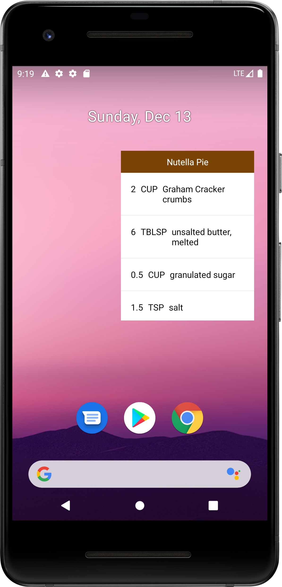
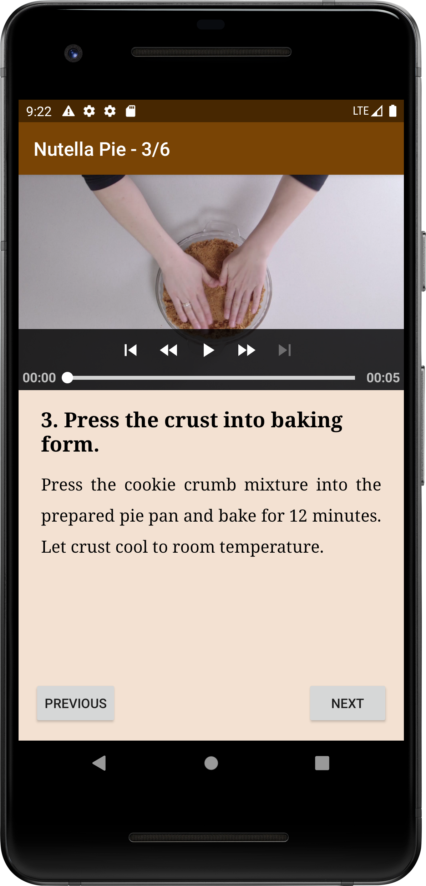
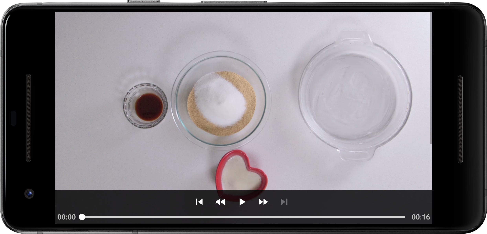
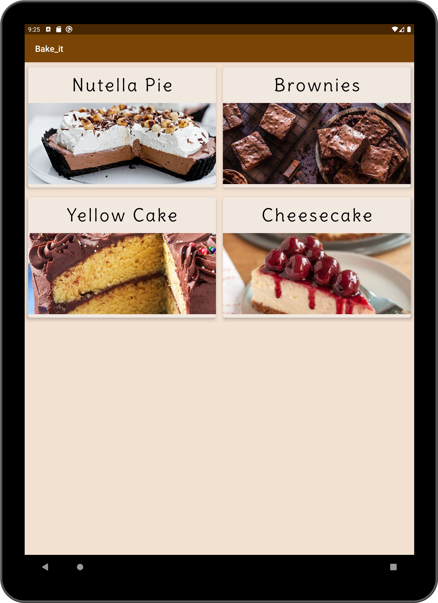
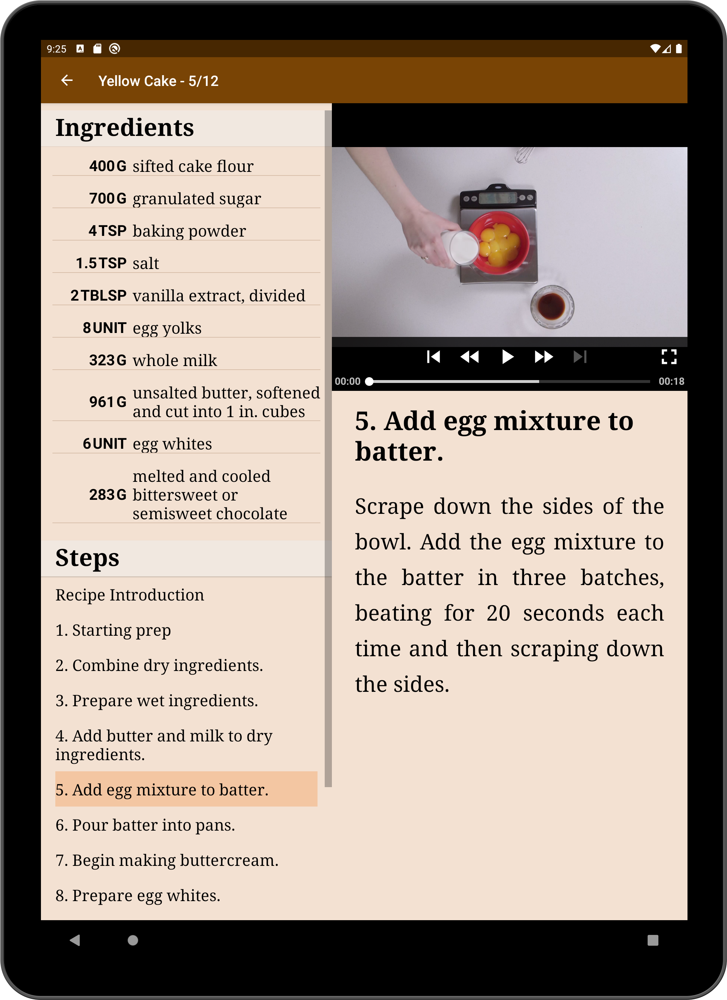
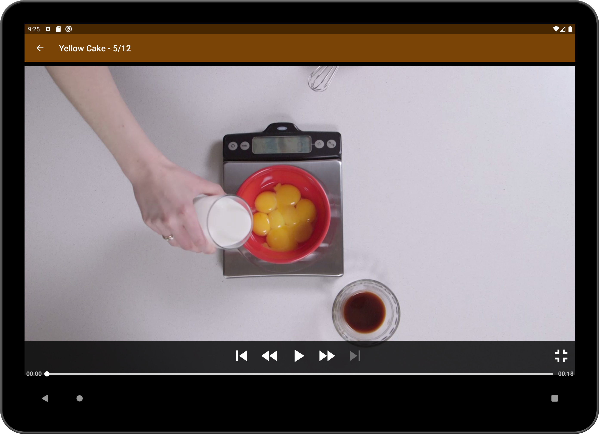

# Bake_it

App project for Udacity Android Developer Nanodegree course  

## Overview
* An app to view baking recipes
* JSON file url provided as source of data 
* ExoPlayer to display steps videos
* Reuse fragments to create a responsive design that works on different phones and tablets.
* Application has a companion homescreen widget listing recipe ingriednent
* Espresso to verify UI workflows.

 

 
 
 
 

 
 

 
